# AdFlowEcomm - Kompletter Workflow

## Übersicht

```
┌─────────────────────────────────────────────────────────────────┐
│                    USER INPUT                                    │
│  - Produktbild URL/Pfad                                         │
│  - Logo URL/Pfad (optional)                                     │
│  - Output-Verzeichnis                                           │
└─────────────────────────────────────────────────────────────────┘
                              │
                              ▼
┌─────────────────────────────────────────────────────────────────┐
│  PHASE 1: PROMPT-GENERIERUNG (OpenAI)                          │
│  ⏱️ ~10-20 Sekunden                                             │
├─────────────────────────────────────────────────────────────────┤
│  1. 🔍 Analysiere Produktbild (Vision API)                     │
│  2. 🔍 Analysiere Logo (Vision API, optional)                   │
│  3. 🤖 Generiere 4 Bild-Prompts (GPT-4o)                       │
│  4. 🤖 Generiere 4 Video-Szenen (GPT-4o)                      │
│     - Hook (7s), Problem (7s), Solution (10s), CTA (6s)        │
└─────────────────────────────────────────────────────────────────┘
                              │
                              ▼
┌─────────────────────────────────────────────────────────────────┐
│  PHASE 2: BILDER GENERIEREN (Runware)                          │
│  ⏱️ ~2-4 Minuten (4 Bilder)                                      │
├─────────────────────────────────────────────────────────────────┤
│  1. 📤 Upload Produktbild → UUID                               │
│  2. 📤 Upload Logo → UUID (optional)                           │
│  3. 🔄 Für jeden Prompt (4x):                                  │
│     - imageInference mit referenceImages                       │
│     - Modell: bfl:2@1 (Flux 1.1 Pro)                          │
│     - ⬇️ Download Bild                                          │
│     - 📤 Upload Bild → UUID für Videos                         │
└─────────────────────────────────────────────────────────────────┘
                              │
                              ▼
┌─────────────────────────────────────────────────────────────────┐
│  PHASE 3: VIDEOS GENERIEREN (Runware)                          │
│  ⏱️ ~8-12 Minuten (4 Videos, sequenziell)                      │
├─────────────────────────────────────────────────────────────────┤
│  Für jede Szene (4x):                                          │
│  1. ⚠️ Passe Duration an (KlingAI: 7s→10s, 6s→5s)             │
│  2. 🎬 videoInference mit frameImages                          │
│     - Modell: klingai:6@1                                      │
│     - frameImages: [generiertes Bild als first frame]         │
│  3. ⏳ Polling bis fertig (~2-3 Min)                           │
│  4. ⬇️ Download Video                                           │
└─────────────────────────────────────────────────────────────────┘
                              │
                              ▼
┌─────────────────────────────────────────────────────────────────┐
│  PHASE 4: AUDIO GENERIEREN (Mirelo)                             │
│  ⏱️ ~2-4 Minuten (4 Audio-Dateien, sequenziell)                 │
├─────────────────────────────────────────────────────────────────┤
│  Für jedes Video (4x):                                         │
│  1. 📤 create_customer_asset → Upload-URL                      │
│  2. 📤 Upload Video zu Mirelo                                  │
│  3. 🎵 video-to-sfx mit text_prompt                           │
│     - Prompt: "Music: [music]. SFX: [sfx]. Dialog: [dialog]"  │
│     - Modell: v1.5                                             │
│  4. ⬇️ Download Audio                                           │
└─────────────────────────────────────────────────────────────────┘
                              │
                              ▼
┌─────────────────────────────────────────────────────────────────┐
│                    OUTPUT                                       │
│  📁 output/                                                     │
│    ├── image_1_*.png (4 Bilder)                                 │
│    ├── scene_1.mp4 (4 Videos)                                  │
│    └── audio_*_scene.mp3 (4 Audio-Dateien)                     │
└─────────────────────────────────────────────────────────────────┘
```

## Aktivitätsdiagramm (Mermaid)

```mermaid
flowchart TD
    Start([Start: User ruft Script auf]) --> Input[User Input:<br/>- Produktbild URL<br/>- Logo URL optional<br/>- Output Verzeichnis]
    
    Input --> CheckKeys{API Keys<br/>prüfen}
    CheckKeys -->|Fehlt Key| Error1[❌ Fehler:<br/>API Key nicht gefunden]
    CheckKeys -->|Alle OK| Step1
    
    Step1[📝 SCHRITT 1:<br/>PROMPTS GENERIEREN<br/>mit OpenAI]
    
    Step1 --> AnalyzeProduct[🔍 OpenAI Vision:<br/>Analysiere Produktbild]
    AnalyzeProduct --> AnalyzeLogo{Logo<br/>vorhanden?}
    AnalyzeLogo -->|Ja| AnalyzeLogoImg[🔍 OpenAI Vision:<br/>Analysiere Logo]
    AnalyzeLogo -->|Nein| GenImagePrompts
    AnalyzeLogoImg --> GenImagePrompts
    
    GenImagePrompts[🤖 GPT-4o:<br/>Generiere 4 Bild-Prompts<br/>für Runware]
    GenImagePrompts --> GenVideoScenes[🤖 GPT-4o:<br/>Generiere 4 Video-Szenen<br/>mit Audio-Design]
    
    GenVideoScenes --> Step2
    
    Step2[🖼️ SCHRITT 2:<br/>BILDER GENERIEREN<br/>mit Runware]
    
    Step2 --> UploadProduct[📤 Lade Produktbild<br/>zu Runware hoch]
    UploadProduct --> GetProductUUID[✅ Erhalte Produktbild UUID]
    
    GetProductUUID --> UploadLogo{Logo<br/>vorhanden?}
    UploadLogo -->|Ja| UploadLogoImg[📤 Lade Logo<br/>zu Runware hoch]
    UploadLogo -->|Nein| GenImages
    UploadLogoImg --> GetLogoUUID[✅ Erhalte Logo UUID]
    GetLogoUUID --> GenImages
    
    GenImages[🔄 Für jeden Prompt:<br/>Generiere Bild mit Runware]
    GenImages --> ImageGen[Runware API:<br/>imageInference mit<br/>referenceImages]
    ImageGen --> ImageReady{Image<br/>fertig?}
    ImageReady -->|Ja| DownloadImage[⬇️ Download Image]
    ImageReady -->|Nein| PollImage[⏳ Polling bis fertig]
    PollImage --> ImageReady
    
    DownloadImage --> UploadForVideo[📤 Upload Image<br/>für Video-Generierung]
    UploadForVideo --> GetImageUUID[✅ Erhalte Image UUID]
    GetImageUUID --> MoreImages{Mehr<br/>Prompts?}
    MoreImages -->|Ja| GenImages
    MoreImages -->|Nein| Step3
    
    Step3[📹 SCHRITT 3:<br/>VIDEOS MIT AUDIO<br/>mit Runware + Mirelo]
    
    Step3 --> ForEachScene[🔄 Für jede Szene:]
    
    ForEachScene --> CheckDuration{KlingAI<br/>Modell?}
    CheckDuration -->|Ja| AdjustDuration[⚠️ Passe Duration an:<br/>7s → 10s<br/>6s → 5s]
    CheckDuration -->|Nein| BuildPrompt
    AdjustDuration --> BuildPrompt
    
    BuildPrompt[📝 Baue Video-Prompt<br/>aus Scene-Description]
    BuildPrompt --> MatchImage{Generierte<br/>Bilder vorhanden?}
    MatchImage -->|Ja| GetImageUUID2[🖼️ Hole Image UUID<br/>für frameImages]
    MatchImage -->|Nein| GenVideo
    GetImageUUID2 --> GenVideo
    
    GenVideo[🎬 Runware API:<br/>videoInference mit<br/>frameImages optional]
    GenVideo --> VideoProcessing[⏳ Video wird generiert...]
    VideoProcessing --> VideoReady{Video<br/>fertig?}
    VideoReady -->|Nein| PollVideo[⏳ Polling Status]
    PollVideo --> VideoReady
    VideoReady -->|Ja| DownloadVideo[⬇️ Download Video]
    
    DownloadVideo --> MireloAudio{Audio<br/>generieren?}
    MireloAudio -->|Nein| NextScene
    MireloAudio -->|Ja| MireloStep1
    
    MireloStep1[📤 Mirelo Step 1:<br/>create_customer_asset]
    MireloStep1 --> GetUploadURL[✅ Erhalte Upload URL]
    GetUploadURL --> MireloStep2[📤 Mirelo Step 2:<br/>Upload Video zu Mirelo]
    MireloStep2 --> MireloStep3[🎵 Mirelo Step 3:<br/>video-to-sfx mit<br/>text_prompt aus audio_design]
    MireloStep3 --> GetAudioURLs[✅ Erhalte Audio URLs]
    GetAudioURLs --> DownloadAudio[⬇️ Download Audio]
    
    DownloadAudio --> NextScene{Mehr<br/>Szenen?}
    NextScene -->|Ja| ForEachScene
    NextScene -->|Nein| Finish
    
    Finish[✅ ERFOLGREICH ABGESCHLOSSEN<br/>📸 4 Bilder generiert<br/>📹 4 Videos generiert<br/>🎵 Audio-Dateien generiert]
    
    Error1 --> End([Ende])
    Finish --> End
    
    style Start fill:#90EE90
    style Finish fill:#90EE90
    style Error1 fill:#FFB6C1
    style Step1 fill:#87CEEB
    style Step2 fill:#87CEEB
    style Step3 fill:#87CEEB
    style GenVideo fill:#FFD700
    style MireloStep3 fill:#FFD700
```



## Detaillierte Beschreibung des Ablaufs

### Phase 1: Prompt-Generierung (OpenAI)

1. **Produktbild-Analyse**
   - OpenAI Vision API analysiert das Produktbild (URL oder lokale Datei)
   - Extrahiert: Produktdetails, Farben, Materialien, Komposition

2. **Logo-Analyse** (optional)
   - Wenn Logo vorhanden: OpenAI Vision analysiert Logo
   - Extrahiert: Logo-Stil, Farben, Platzierungsmöglichkeiten

3. **Bild-Prompt-Generierung**
   - GPT-4o generiert 4 detaillierte Bild-Prompts für Runware
   - Jeder Prompt enthält: Use-Case, visuelle Beschreibung, Logo-Integration

4. **Video-Szenen-Generierung**
   - GPT-4o generiert 4 Video-Szenen (Hook, Problem, Solution, CTA)
   - Jede Szene enthält:
     - Visuelle Beschreibung
     - Kamera-Bewegung
     - Beleuchtung & Stimmung
     - Audio-Design (Music, SFX, Dialog)

### Phase 2: Bild-Generierung (Runware)

1. **Produktbild-Upload**
   - Produktbild wird zu Runware hochgeladen
   - Erhält `imageUUID` für `referenceImages`

2. **Logo-Upload** (optional)
   - Logo wird zu Runware hochgeladen
   - Erhält `imageUUID` (wird aktuell nicht verwendet, da nur 1 Referenz erlaubt)

3. **Bild-Generierung** (4x parallel möglich)
   - Für jeden Prompt:
     - Runware API: `imageInference` mit `referenceImages=[product_uuid]`
     - Modell: `bfl:2@1` (Flux 1.1 Pro)
     - Image-to-Image Generation
   - Bild wird heruntergeladen
   - Bild wird erneut hochgeladen → erhält UUID für Video-Generierung

### Phase 3: Video-Generierung (Runware + Mirelo)

Für jede der 4 Szenen:

1. **Duration-Anpassung**
   - Wenn KlingAI: 7s → 10s, 6s → 5s
   - Andere Modelle: Original-Duration

2. **Video-Generierung**
   - Runware API: `videoInference`
   - Modell: `klingai:6@1` (KlingAI 2.5 Turbo Pro)
   - `frameImages`: Verwendet generiertes Bild als ersten Frame
   - Polling bis Video fertig ist
   - Video wird heruntergeladen

3. **Audio-Generierung** (Mirelo)
   - **Step 1**: `create_customer_asset()` → Upload-URL
   - **Step 2**: Video zu Mirelo hochladen
   - **Step 3**: `video-to-sfx` mit kombiniertem Prompt:
     - "Background music: [music description]. Sound effects: [sfx description]. Dialog/narration: [dialog]"
   - **Step 4**: Audio herunterladen

### Output-Struktur

```
output/
├── image_1_morning_espresso_ritual.png
├── image_2_evening_coffee_indulgence.png
├── image_3_kitchen_elegance_and_functionality.png
├── image_4_effortless_coffee_experience.png
├── scene_1.mp4
├── scene_2.mp4
├── scene_3.mp4
├── scene_4.mp4
├── audio_[uuid]_scene.mp3  (für Scene 1)
├── audio_[uuid]_scene.mp3  (für Scene 2)
├── audio_[uuid]_scene.mp3  (für Scene 3)
└── audio_[uuid]_scene.mp3  (für Scene 4)
```

## API-Aufrufe im Detail

### OpenAI API
- **Vision API**: Produktbild- und Logo-Analyse
- **Chat API (GPT-4o)**: Prompt-Generierung für Bilder und Videos

### Runware API
- **imageUpload**: Produktbild/Logo hochladen
- **imageInference**: Bilder generieren (mit `referenceImages`)
- **imageUpload**: Generierte Bilder hochladen (für Videos)
- **videoInference**: Videos generieren (mit `frameImages`)
- **getResponse**: Status-Polling für async Tasks

### Mirelo API
- **POST /create-customer-asset**: Upload-URL erstellen
- **PUT [upload_url]**: Video hochladen
- **POST /video-to-sfx**: Audio generieren
- **GET [audio_url]**: Audio herunterladen

## Timing-Schätzungen

- **Prompt-Generierung**: ~10-20 Sekunden
- **Bild-Generierung**: ~30-60 Sekunden pro Bild, **parallel** → ~1-2 Minuten (statt ~2-4 Minuten)
- **Video-Generierung**: ~2-3 Minuten pro Video (4 Videos = ~8-12 Minuten, sequenziell wegen Frame-Übergabe)
- **Audio-Generierung**: ~30-60 Sekunden pro Video, **parallel** → ~1-2 Minuten (statt ~2-4 Minuten)
- **Gesamt**: ~10-15 Minuten für kompletten Workflow (statt ~15-20 Minuten)

---

## Textuelle Beschreibung des Ablaufs

### Eingabe
- **Produktbild**: URL oder lokaler Pfad
- **Logo**: URL oder lokaler Pfad (optional)
- **Output-Verzeichnis**: Wo die generierten Dateien gespeichert werden

### Phase 1: Prompt-Generierung (OpenAI) ⏱️ ~10-20s

1. **Produktbild-Analyse**
   - OpenAI Vision API analysiert das Produktbild
   - Extrahiert: Produktdetails, Materialien, Farben, Komposition

2. **Logo-Analyse** (falls vorhanden)
   - OpenAI Vision API analysiert das Logo
   - Extrahiert: Logo-Stil, Farben, Platzierungsmöglichkeiten

3. **Bild-Prompt-Generierung**
   - GPT-4o generiert 4 detaillierte Bild-Prompts
   - Jeder Prompt: Use-Case, visuelle Beschreibung, Logo-Integration

4. **Video-Szenen-Generierung**
   - GPT-4o generiert 4 Video-Szenen (Hook, Problem, Solution, CTA)
   - Jede Szene: Visuelle Beschreibung, Kamera, Beleuchtung, Audio-Design

### Phase 2: Bild-Generierung (Runware) ⏱️ ~1-2 Minuten (parallel)

1. **Produktbild-Upload**
   - Produktbild wird zu Runware hochgeladen
   - Erhält `imageUUID` für `referenceImages`

2. **Logo-Upload** (optional)
   - Logo wird zu Runware hochgeladen
   - Erhält `imageUUID` (aktuell nicht verwendet, da nur 1 Referenz erlaubt)

3. **Bild-Generierung** (4x **parallel** mit Threading)
   - Alle 4 Bilder werden gleichzeitig generiert (ThreadPoolExecutor)
   - Für jeden Prompt:
     - Runware API: `imageInference` mit `referenceImages=[product_uuid]`
     - Modell: `bfl:2@1` (Flux 1.1 Pro)
     - Image-to-Image Generation
   - Bilder werden heruntergeladen
   - Bilder werden erneut hochgeladen → erhalten UUIDs für Video-Generierung
   - **Vorteil**: Deutlich schneller als sequenzielle Generierung (~4x schneller)

### Phase 3: Video-Generierung (Runware) ⏱️ ~8-12 Minuten

Für jede der 4 Szenen (sequenziell, da Frame-Übergabe erforderlich):

1. **Duration-Anpassung**
   - Wenn KlingAI: 7s → 10s, 6s → 5s
   - Andere Modelle: Original-Duration

2. **Video-Generierung**
   - Runware API: `videoInference`
   - Modell: `klingai:6@1` (KlingAI 2.5 Turbo Pro)
   - **Frame-Übergabe**: 
     - **Scene 1**: Verwendet generiertes Bild als ersten Frame
     - **Scene 2-4**: Verwendet **letzten Frame des vorherigen Videos** als ersten Frame
     - Dadurch nahtlose Übergänge zwischen Szenen
   - Polling bis Video fertig ist (~2-3 Minuten)
   - Video wird heruntergeladen
   - **Letzter Frame wird extrahiert** (FFmpeg) und zu Runware hochgeladen für nächstes Video

### Phase 4: Audio-Generierung (Mirelo) ⏱️ ~1-2 Minuten (parallel)

Für jedes generierte Video (**parallel** mit Threading, nachdem alle Videos fertig sind):

1. **Customer Asset erstellen**
   - Mirelo API: `POST /create-customer-asset`
   - Erhält Upload-URL

2. **Video hochladen**
   - Video wird zu Mirelo hochgeladen (PUT auf Upload-URL)

3. **Audio generieren**
   - Mirelo API: `POST /video-to-sfx`
   - Text-Prompt: Kombiniert Music, SFX, Dialog aus `audio_design`
   - Modell: v1.5
   - Erhält Audio-URLs

4. **Audio herunterladen**
   - Audio wird heruntergeladen und gespeichert
   - **Vorteil**: Alle Audio-Dateien werden parallel generiert (~4x schneller)

### Output

```
output/
├── image_1_morning_espresso_ritual.png
├── image_2_evening_coffee_indulgence.png
├── image_3_kitchen_elegance_and_functionality.png
├── image_4_effortless_coffee_experience.png
├── scene_1.mp4
├── scene_2.mp4
├── scene_3.mp4
├── scene_4.mp4
├── audio_[uuid]_scene.mp3  (für Scene 1)
├── audio_[uuid]_scene.mp3  (für Scene 2)
├── audio_[uuid]_scene.mp3  (für Scene 3)
└── audio_[uuid]_scene.mp3  (für Scene 4)
```

### Nächste Schritte (manuell)

- Videos mit FFmpeg zusammenfügen
- Audio mit FFmpeg zu Videos hinzufügen
- Finales 30-Sekunden Video erstellen

---

## Neue Features: Threading & Frame-Übergabe

### 🚀 Parallele Bild-Generierung

- **Vorher**: 4 Bilder sequenziell → ~2-4 Minuten
- **Jetzt**: 4 Bilder parallel → ~1-2 Minuten
- **Implementierung**: `ThreadPoolExecutor` mit max 4 Workers
- **Parameter**: `parallel=True` (Standard)

### 🎬 Frame-Übergabe zwischen Videos

- **Feature**: Letzter Frame eines Videos wird als erster Frame des nächsten Videos verwendet
- **Vorteil**: Nahtlose Übergänge zwischen Szenen
- **Implementierung**: 
  - FFmpeg extrahiert letzten Frame (0.1s vor Ende)
  - Frame wird zu Runware hochgeladen
  - UUID wird für nächstes Video als `frameImages` verwendet
- **Parameter**: `use_last_frame=True` (Standard)
- **Priorität**: 
  1. Letzter Frame des vorherigen Videos (wenn verfügbar)
  2. Generiertes Bild (Scene 1)
  3. Text-only (Fallback)

### 🎵 Parallele Audio-Generierung

- **Vorher**: Audio sequenziell nach jedem Video → ~2-4 Minuten
- **Jetzt**: Alle Audio-Dateien parallel nach allen Videos → ~1-2 Minuten
- **Implementierung**: `ThreadPoolExecutor` mit max 4 Workers
- **Timing**: Startet erst nachdem alle Videos fertig sind

### ⚙️ Konfiguration

```python
# Bilder parallel generieren
generated_images = asset_generator.generate_images(
    prompts=image_prompts,
    parallel=True  # Standard: True
)

# Videos mit Frame-Übergabe generieren
generated_videos = asset_generator.generate_video_scenes(
    scenes=video_scenes,
    generated_images=generated_images,
    use_last_frame=True,  # Standard: True
    generate_audio=True  # Audio wird parallel generiert
)
```

